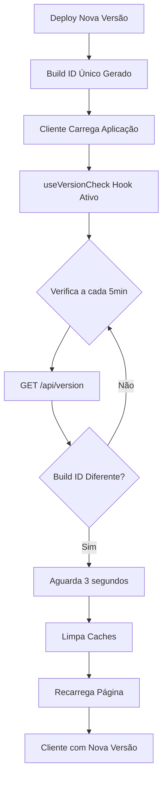

# 🔄 Sistema de Cache-Busting Automático

## 📋 Visão Geral

Este documento descreve o sistema de cache-busting implementado para garantir que todos os clientes sempre tenham a versão mais recente do aplicativo, sem necessidade de hard refresh manual (Ctrl + Shift + R).

## 🎯 Problema Resolvido

**Cenário**: Um bug de vendas duplicadas foi corrigido, mas alguns clientes ainda experimentavam o problema porque seus navegadores estavam usando código JavaScript em cache.

**Solução**: Sistema automático de verificação de versão que:
1. Detecta quando uma nova versão foi implantada
2. Recarrega automaticamente a página para obter a versão mais recente
3. Funciona de forma transparente sem ação do usuário

## 🏗️ Arquitetura da Solução



## 🔧 Componentes Implementados

### 1. Geração de Build ID (`next.config.js`)

```javascript
generateBuildId: async () => {
  // Usa timestamp para forçar novos chunks em cada deployment
  return `build-${Date.now()}`
}
```

**Como funciona**:
- Cada build gera um ID único baseado no timestamp
- Next.js usa este ID nos nomes dos arquivos JavaScript
- Exemplo: `build-1764681779343`

### 2. API de Versão (`/api/version`)

**Endpoint**: `GET /api/version`

**Resposta**:
```json
{
  "success": true,
  "buildId": "build-1764681779343",
  "timestamp": "2025-12-02T13:24:58.779Z"
}
```

**Headers**:
- `Cache-Control: no-cache, no-store, must-revalidate`
- `Pragma: no-cache`
- `Expires: 0`

### 3. Version Checker (`lib/version-checker.ts`)

**Funções principais**:

```typescript
// Obtém versão atual
getCurrentVersion(): Promise<string | null>

// Verifica se há nova versão
checkForNewVersion(): Promise<boolean>

// Recarrega para versão mais recente
reloadToLatestVersion(): void

// Inicia verificação automática
startVersionChecking(onNewVersion?: () => void): () => void
```

**Configuração**:
- Intervalo de verificação: 5 minutos
- Delay antes de recarregar: 3 segundos
- Storage: localStorage (`meguispet_app_version`)

### 4. React Hook (`hooks/useVersionCheck.ts`)

```typescript
import { useVersionCheck } from '@/hooks/useVersionCheck'

// Em qualquer componente
function MyComponent() {
  useVersionCheck({
    enabled: true,
    onNewVersion: () => {
      // Custom callback (opcional)
      console.log('Nova versão disponível!')
    }
  })
}
```

**Integrado em** `pages/_app.tsx` para funcionar em todas as páginas.

### 5. Cache Headers

#### Vercel.json
```json
{
  "headers": [
    {
      "source": "/(.*)",
      "headers": [
        {
          "key": "Cache-Control",
          "value": "no-cache, no-store, must-revalidate, max-age=0"
        }
      ]
    },
    {
      "source": "/_next/static/(.*)",
      "headers": [
        {
          "key": "Cache-Control",
          "value": "public, max-age=31536000, immutable"
        }
      ]
    }
  ]
}
```

#### _document.tsx
```html
<meta httpEquiv="Cache-Control" content="no-cache, no-store, must-revalidate" />
<meta httpEquiv="Pragma" content="no-cache" />
<meta httpEquiv="Expires" content="0" />
```

## 📊 Fluxo de Funcionamento

### Primeiro Acesso
1. Cliente acessa a aplicação
2. `useVersionCheck` obtém build ID via `/api/version`
3. Salva no localStorage: `meguispet_app_version = "build-1764681779343"`
4. Inicia verificação periódica a cada 5 minutos

### Após Deploy de Nova Versão
1. Nova versão é implantada com build ID: `build-1764681850000`
2. Cliente continua usando a aplicação
3. Após 5 minutos, verificação automática roda
4. `getCurrentVersion()` retorna `"build-1764681850000"`
5. Compara com localStorage: `"build-1764681779343"` ≠ `"build-1764681850000"`
6. Console: "New version available - reloading in 3 seconds..."
7. Limpa todos os caches do Service Worker (se houver)
8. `window.location.reload()` - hard reload
9. Nova versão carregada!

## 🎛️ Configurações Avançadas

### Alterar Intervalo de Verificação

Em `lib/version-checker.ts`:
```typescript
const VERSION_CHECK_INTERVAL = 5 * 60 * 1000 // 5 minutos
// Altere para 10 minutos:
const VERSION_CHECK_INTERVAL = 10 * 60 * 1000
```

### Custom Callback para Nova Versão

```typescript
useVersionCheck({
  enabled: true,
  onNewVersion: () => {
    // Mostrar notificação ao usuário
    toast({
      title: "Nova versão disponível",
      description: "Recarregando em 3 segundos...",
    })
  }
})
```

### Desabilitar em Desenvolvimento

```typescript
useVersionCheck({
  enabled: process.env.NODE_ENV === 'production'
})
```

## 🧪 Como Testar

### Teste Local

1. **Build inicial**:
```bash
pnpm build:local
pnpm start:local
```

2. **Verificar build ID atual**:
```bash
curl http://localhost:3000/api/version
# Resposta: {"success":true,"buildId":"build-1764681779343",...}
```

3. **Simular nova versão**:
```bash
# Pare o servidor (Ctrl+C)
# Faça uma mudança qualquer no código
# Rebuild e restart
pnpm build:local
pnpm start:local
```

4. **Verificar novo build ID**:
```bash
curl http://localhost:3000/api/version
# Resposta: {"success":true,"buildId":"build-1764681850000",...}
```

5. **Observar reload automático**:
- Abra o navegador em `http://localhost:3000`
- Abra DevTools > Console
- Aguarde 5 minutos ou force verificação no console:
```javascript
// No console do navegador
import('/lib/version-checker.js').then(m => m.checkForNewVersion())
```

### Teste em Produção (Vercel)

1. **Deploy para Vercel**:
```bash
git push origin master
```

2. **Verificar versão atual**:
```bash
curl https://gestao.meguispet.com/api/version
```

3. **Fazer alteração e novo deploy**:
```bash
# Faça uma mudança
git commit -am "test: trigger new build"
git push origin master
```

4. **Aguardar deploy e verificar**:
- Clientes com a página aberta receberão reload automático em até 5 minutos

## 🔍 Debugging

### Ver versão no Console

```javascript
// Console do navegador
localStorage.getItem('meguispet_app_version')
// Output: "build-1764681779343"
```

### Forçar Verificação Manual

```javascript
// Console do navegador
await fetch('/api/version', {
  cache: 'no-cache',
  headers: {
    'Cache-Control': 'no-cache, no-store, must-revalidate',
    'Pragma': 'no-cache',
    'Expires': '0'
  }
}).then(r => r.json())
```

### Limpar Versão Armazenada

```javascript
// Console do navegador
localStorage.removeItem('meguispet_app_version')
```

## ⚠️ Considerações

### Vantagens
- ✅ Totalmente automático - não requer ação do usuário
- ✅ Garante que bugs corrigidos cheguem a todos os clientes
- ✅ Funciona em segundo plano sem interromper o trabalho
- ✅ Delay de 3 segundos permite salvar trabalho antes do reload
- ✅ Limpa todos os caches antes do reload

### Limitações
- ⚠️ Reload pode interromper trabalho não salvo
- ⚠️ Verificação a cada 5 minutos - não instantânea
- ⚠️ Requer JavaScript habilitado no cliente

### Mitigações
- Formulários devem implementar auto-save
- Usuários devem salvar trabalho periodicamente
- Sistema pode ser desabilitado em páginas críticas se necessário

## 📈 Monitoramento

### Métricas Recomendadas
1. **Taxa de Reload**: Quantos clientes foram recarregados após deploy?
2. **Tempo até Reload**: Quanto tempo após deploy o reload acontece?
3. **Erros de API**: Falhas ao chamar `/api/version`

### Logs
Verificar console do navegador para:
- `"New version detected: build-XXX (current: build-YYY)"`
- `"Reloading to get latest version..."`
- `"Error checking app version:"`

## 🚀 Deployment Checklist

- [x] `generateBuildId` configurado em `next.config.js`
- [x] Headers de cache configurados em `vercel.json`
- [x] API `/api/version` implementada
- [x] `lib/version-checker.ts` implementado
- [x] `hooks/useVersionCheck.ts` criado
- [x] Hook integrado em `pages/_app.tsx`
- [x] Meta tags de cache em `_document.tsx`
- [ ] Testar em ambiente de staging
- [ ] Monitorar após deploy em produção

## 📚 Referências

- [Next.js Build ID](https://nextjs.org/docs/pages/api-reference/next-config-js/generateBuildId)
- [Cache-Control Headers](https://developer.mozilla.org/en-US/docs/Web/HTTP/Headers/Cache-Control)
- [Vercel Caching](https://vercel.com/docs/edge-network/caching)

---

**Autor**: Copilot Agent  
**Data**: 2025-12-02  
**Versão**: 1.0
