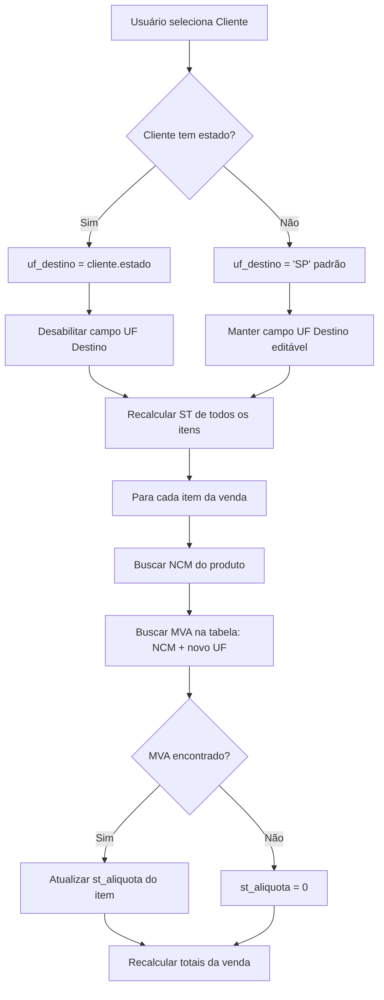

# Plano: UF Destino Automático a partir do Cliente

**Status**: 🟡 Aguardando aprovação
**Prioridade**: Alta
**Impacto**: Médio
**Área**: Sistema de Vendas

## 1. Objetivo

Automatizar o preenchimento do campo **UF de Destino** no formulário de vendas, puxando automaticamente o estado cadastrado no cliente quando este for selecionado. Este campo é crítico para o cálculo correto da Substituição Tributária (ST) através da tabela MVA.

## 2. Motivação

### Problema Atual
- O campo "UF de Destino" é preenchido **manualmente** pelo usuário (padrão: 'SP')
- Isso pode gerar erros de digitação ou esquecimento de alterar o UF
- O cálculo de ST pode ficar **incorreto** se o UF não corresponder ao do cliente
- Há risco de aplicar MVA errado (ex: cliente de MG mas sistema calcula ST de SP)

### Benefícios da Mudança
✅ **Automação**: UF preenchido automaticamente ao selecionar o cliente
✅ **Precisão**: Cálculo de ST sempre baseado no UF correto do cliente
✅ **UX melhorada**: Menos campos manuais para o usuário preencher
✅ **Consistência**: UF de destino sempre sincronizado com cadastro do cliente

## 3. Comportamento Desejado

### Fluxo Principal

```
1. Usuário abre formulário de nova venda
   └─> UF Destino = 'SP' (padrão)

2. Usuário seleciona um cliente
   └─> Sistema busca o campo `estado` do cliente
   └─> Se cliente.estado existe: UF Destino = cliente.estado
   └─> Se cliente.estado for null/undefined: UF Destino = 'SP' (padrão)
   └─> Campo UF Destino fica **desabilitado** (somente leitura)

3. Quando UF Destino muda (por seleção de cliente)
   └─> Recalcular ST de TODOS os itens já adicionados
   └─> Buscar novamente MVA correto para cada produto (NCM + novo UF)

4. Usuário desmarca/remove cliente
   └─> Campo UF Destino volta a ser **editável**
   └─> Mantém o valor atual até ser editado manualmente
```

### Casos de Uso

#### Caso 1: Cliente com Estado Cadastrado
```typescript
// Cliente selecionado
const cliente = {
  id: 123,
  nome: "Pet Shop Belo Horizonte",
  estado: "MG"
}

// Resultado no formulário
formData.uf_destino = "MG" // Preenchido automaticamente
// Campo UF Destino desabilitado
```

#### Caso 2: Cliente sem Estado Cadastrado
```typescript
// Cliente selecionado
const cliente = {
  id: 456,
  nome: "Cliente Novo",
  estado: null // ou undefined
}

// Resultado no formulário
formData.uf_destino = "SP" // Mantém padrão
// Campo UF Destino habilitado (permite edição manual)
```

#### Caso 3: Edição de Venda Existente
```typescript
// Ao carregar venda para editar
const venda = {
  cliente_id: 123,
  uf_destino: "RJ" // Já salvo
}

// Comportamento
// 1. Carrega UF salvo na venda (RJ)
// 2. Se trocar o cliente, busca o estado do novo cliente
// 3. Se novo cliente.estado = "MG", atualiza para "MG"
// 4. Recalcula ST de todos os itens
```

## 4. Análise Técnica

### Arquivos Afetados

#### 1. `components/forms/VendaForm.tsx` (Principal)

**Mudanças necessárias:**

```typescript
// LOCALIZAÇÃO: Linhas 613-624 (onChange do select de cliente)
onChange={(e) => {
  const clienteId = e.target.value
  setFormData(prev => {
    const cliente = clientes.find(c => String(c.id) === clienteId)
    let vendedorId = prev.vendedor_id
    let ufDestino = prev.uf_destino // NOVO: puxar UF do cliente

    if (cliente) {
      // Lógica vendedor (já existe)
      if (cliente.vendedor_id || cliente.vendedor?.id) {
        const vendedorPadrao = cliente.vendedor_id ?? cliente.vendedor?.id
        vendedorId = vendedorPadrao ? String(vendedorPadrao) : prev.vendedor_id
      }

      // NOVO: Lógica UF Destino
      if (cliente.estado) {
        ufDestino = cliente.estado // Puxar do cliente
      } else {
        ufDestino = 'SP' // Padrão se cliente não tem estado
      }
    } else {
      // Cliente desmarcado: mantém UF atual (permite edição manual)
      ufDestino = prev.uf_destino
    }

    return {
      ...prev,
      cliente_id: clienteId,
      vendedor_id: vendedorId,
      uf_destino: ufDestino // NOVO
    }
  })

  // NOVO: Recalcular ST dos itens quando UF muda
  // Precisa forçar recálculo de todos os produtos já adicionados
})
```

**Localização: Linhas 702-737 (Campo UF Destino)**

```typescript
<div>
  <Label htmlFor="uf_destino">
    UF de Destino
    {formData.cliente_id && (
      <span className="text-xs text-gray-500 ml-2">
        (do cadastro do cliente)
      </span>
    )}
  </Label>
  <select
    id="uf_destino"
    value={formData.uf_destino}
    onChange={(e) => {
      const novoUf = e.target.value
      setFormData(prev => ({ ...prev, uf_destino: novoUf }))

      // NOVO: Recalcular ST de todos os itens quando UF é alterado manualmente
      recalcularStTodosItens(novoUf)
    }}
    className="w-full p-2 border rounded-md"
    disabled={!!formData.cliente_id} // NOVO: Desabilitar se cliente selecionado
  >
    {/* Opções UF (mantém todas) */}
  </select>

  {/* NOVO: Mensagem informativa */}
  {formData.cliente_id && (
    <p className="text-xs text-blue-600 mt-1">
      UF preenchido automaticamente a partir do cadastro do cliente
    </p>
  )}
  {!formData.cliente_id && (
    <p className="text-xs text-gray-500 mt-1">
      Selecione um cliente para preencher automaticamente
    </p>
  )}
</div>
```

#### 2. Função de Recalcular ST

**Nova função necessária:**

```typescript
/**
 * Recalcula o ST de todos os itens quando o UF de destino muda
 * @param novoUf - Novo UF de destino
 */
const recalcularStTodosItens = async (novoUf: string) => {
  if (itens.length === 0) return

  const novosItens = [...itens]

  for (let index = 0; index < novosItens.length; index++) {
    const item = novosItens[index]

    if (item.produto_id > 0) {
      const produto = produtos.find(p => p.id === item.produto_id)

      if (produto) {
        try {
          // Buscar configuração fiscal do produto
          const fiscalConfig = await impostosService.getByProdutoId(produto.id)

          if (fiscalConfig && fiscalConfig.ncm && novoUf) {
            // Buscar MVA para o novo UF
            const mvaData = await impostosService.getMVA(novoUf, fiscalConfig.ncm)

            if (mvaData && mvaData.sujeito_st && mvaData.mva) {
              // Atualizar ST do item
              novosItens[index].st_aliquota = (mvaData.mva * 100) || 0
            } else {
              // Produto não tem ST para este UF
              novosItens[index].st_aliquota = 0
            }
          } else {
            novosItens[index].st_aliquota = 0
          }
        } catch (error) {
          console.error(`Erro ao recalcular ST do item ${index}:`, error)
          novosItens[index].st_aliquota = 0
        }
      }
    }
  }

  // Atualizar estado dos itens
  setItens(novosItens)
}
```

#### 3. Effect para reagir a mudanças de UF

**Adicionar useEffect:**

```typescript
// NOVO: Recalcular ST quando UF de destino mudar
useEffect(() => {
  if (itens.length > 0 && formData.uf_destino) {
    void recalcularStTodosItens(formData.uf_destino)
  }
}, [formData.uf_destino]) // Dispara quando UF muda
```

### Fluxo de Dados



## 5. Impactos e Riscos

### Impactos Positivos
✅ Menos erros humanos no preenchimento de UF
✅ ST sempre calculado corretamente baseado no cliente
✅ Menos campos para o usuário preencher manualmente
✅ Mais confiança nos cálculos de impostos

### Riscos e Mitigações

| Risco | Probabilidade | Impacto | Mitigação |
|-------|--------------|---------|-----------|
| Clientes sem estado cadastrado | Alta | Médio | Manter 'SP' como padrão e permitir edição manual |
| Performance ao recalcular ST de muitos itens | Média | Baixo | Fazer chamadas paralelas com Promise.all |
| UF do cliente desatualizado | Média | Médio | Permitir override manual quando necessário |
| Vendas antigas com UF diferente do cliente | Baixa | Baixo | Ao editar, respeitar UF salvo inicialmente |

### Performance

- **Impacto esperado**: Baixo a Médio
- **Cenário crítico**: Venda com 20+ itens e mudança de cliente
- **Otimização**: Usar `Promise.all()` para buscar MVA de todos os produtos em paralelo

```typescript
// Versão otimizada (em paralelo)
const recalcularStTodosItens = async (novoUf: string) => {
  if (itens.length === 0) return

  const novosItens = await Promise.all(
    itens.map(async (item, index) => {
      if (item.produto_id > 0) {
        const produto = produtos.find(p => p.id === item.produto_id)

        if (produto) {
          try {
            const fiscalConfig = await impostosService.getByProdutoId(produto.id)

            if (fiscalConfig && fiscalConfig.ncm && novoUf) {
              const mvaData = await impostosService.getMVA(novoUf, fiscalConfig.ncm)

              if (mvaData && mvaData.sujeito_st && mvaData.mva) {
                return { ...item, st_aliquota: (mvaData.mva * 100) || 0 }
              }
            }
          } catch (error) {
            console.error(`Erro ao recalcular ST do item ${index}:`, error)
          }
        }
      }

      return { ...item, st_aliquota: 0 }
    })
  )

  setItens(novosItens)
}
```

## 6. Casos Especiais

### Venda sem Cliente
- UF Destino permanece editável
- Padrão 'SP'
- Usuário pode alterar manualmente

### Cliente de outro País
- Se `estado = null` mas cliente é estrangeiro
- UF Destino = 'EX' (Exterior) ou permite edição manual
- **Decisão necessária**: Como tratar clientes internacionais?

### Múltiplos Endereços
- **Cenário futuro**: Cliente com múltiplos endereços em UFs diferentes
- **Solução atual**: Usar UF do cadastro principal
- **Evolução futura**: Permitir selecionar endereço de entrega

## 7. Testes Necessários

### Testes Funcionais

1. **Novo cliente com estado cadastrado**
   - Criar venda
   - Selecionar cliente com estado = "MG"
   - Verificar: `uf_destino = "MG"` e campo desabilitado
   - Adicionar produto
   - Verificar: ST calculado com MVA de MG

2. **Cliente sem estado**
   - Selecionar cliente com estado = null
   - Verificar: `uf_destino = "SP"` e campo editável
   - Alterar manualmente para "RJ"
   - Verificar: ST recalculado com MVA de RJ

3. **Mudança de cliente**
   - Criar venda com Cliente A (UF = SP)
   - Adicionar 3 produtos
   - Trocar para Cliente B (UF = MG)
   - Verificar: Todos os 3 produtos recalculam ST com MVA de MG

4. **Edição de venda existente**
   - Abrir venda salva com UF = RJ
   - Verificar: Mantém UF = RJ (não sobrescreve)
   - Trocar cliente
   - Verificar: UF atualiza para o do novo cliente

5. **Performance com muitos itens**
   - Criar venda com 20 produtos
   - Trocar cliente (mudando UF)
   - Verificar: Todos os produtos recalculam ST sem travar a UI

### Testes de Regressão

- Vendas sem cliente continuam funcionando
- Criação de venda sem alterar cliente funciona normalmente
- Edição de vendas antigas não quebra

## 8. Checklist de Implementação

### Frontend

- [ ] Modificar `onChange` do select de cliente para puxar `estado`
- [ ] Atualizar `formData.uf_destino` automaticamente
- [ ] Adicionar propriedade `disabled` ao select UF quando cliente selecionado
- [ ] Criar função `recalcularStTodosItens(novoUf: string)`
- [ ] Adicionar `useEffect` para reagir a mudanças de `uf_destino`
- [ ] Otimizar recálculo com `Promise.all()` para performance
- [ ] Adicionar mensagens informativas (UF do cliente vs. manual)
- [ ] Adicionar indicador visual de "carregando" durante recálculo

### Validações

- [ ] Validar que `cliente.estado` é uma UF válida (2 caracteres)
- [ ] Tratar caso de cliente sem estado (manter 'SP' ou permitir manual)
- [ ] Validar que recálculo de ST não quebra com itens inválidos

### UX/UI

- [ ] Indicador visual: campo desabilitado quando cliente selecionado
- [ ] Mensagem: "UF preenchido automaticamente a partir do cadastro do cliente"
- [ ] Mensagem: "Selecione um cliente para preencher automaticamente"
- [ ] Loading spinner durante recálculo de ST (se demorar > 500ms)

### Backend (Opcional)

- [ ] Verificar se API `/vendas` salva corretamente `uf_destino`
- [ ] Validar que `uf_destino` é persistido corretamente no banco

## 9. Estimativa de Esforço

**Complexidade**: Média
**Tempo estimado**:
- Desenvolvimento: 2-3 horas
- Testes: 1-2 horas
- Documentação: 30 minutos
- **Total**: ~4-6 horas

**Priorização**: Alta (impacta diretamente cálculo de impostos)

## 10. Próximos Passos

Após aprovação deste plano:

1. ✅ Implementar mudanças no `VendaForm.tsx`
2. ✅ Criar função `recalcularStTodosItens()`
3. ✅ Adicionar `useEffect` para UF destino
4. ✅ Testar com clientes de diferentes UFs
5. ✅ Testar performance com muitos itens
6. ✅ Verificar vendas existentes (edição)
7. ✅ Documentar mudanças no changelog
8. ✅ Commit e push

---

**Criado em**: 2025-01-28
**Autor**: Claude Code
**Aprovação pendente**: ⏳ Aguardando usuário
