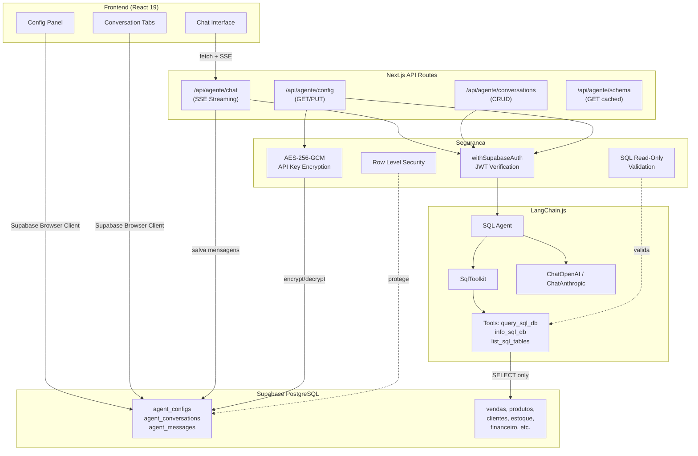
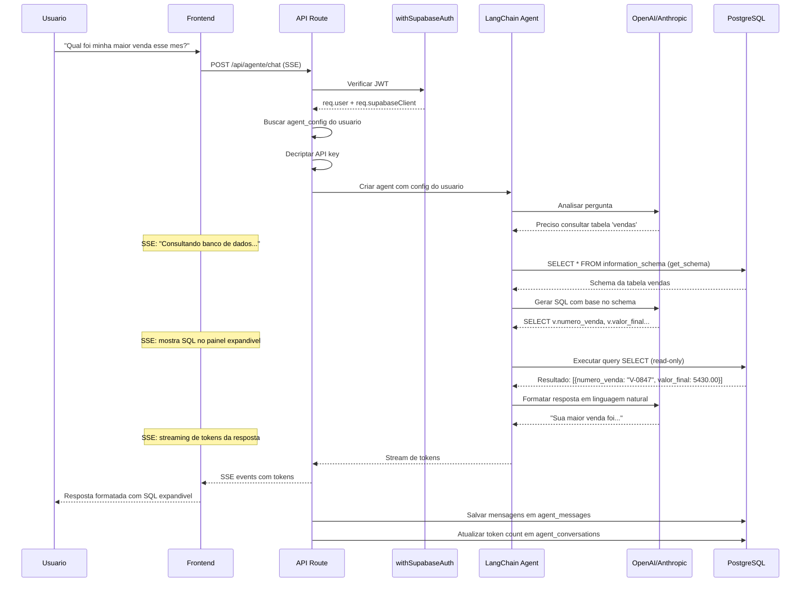
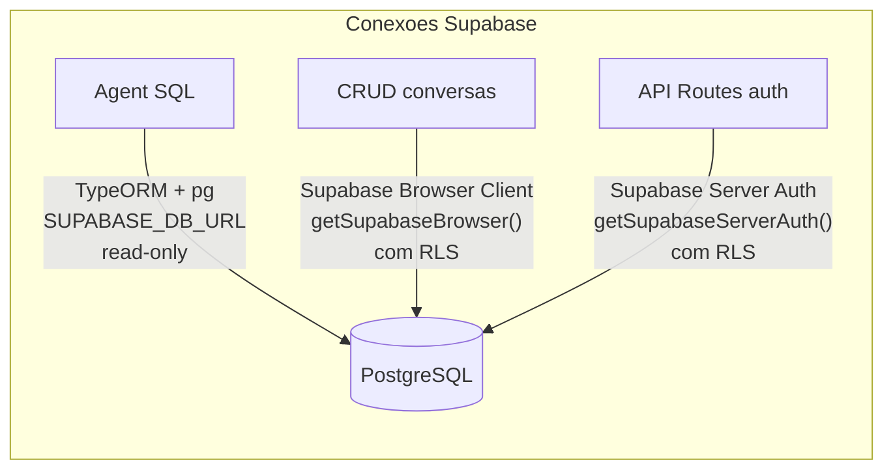

# Arquitetura Tecnica - Agente Megui

## Visao geral da arquitetura



## Fluxo de uma pergunta



## Componentes do sistema

### 1. LangChain SQL Agent

O core do sistema usa o `createSqlAgent` do LangChain.js que orquestra:

- **SqlDatabase**: Conecta ao PostgreSQL via TypeORM com driver `pg`
- **SqlToolkit**: Fornece 3 ferramentas automaticas:
  - `query_sql_db` - Executa queries SELECT
  - `info_sql_db` - Retorna schema de tabelas especificas
  - `list_sql_tables` - Lista tabelas disponiveis
- **LLM**: Modelo configurado pelo usuario (GPT-4o, Claude, etc)
- **System Prompt**: Instrucoes customizaveis sobre contexto do negocio

O agent segue um loop ReAct (Reason + Act):
1. Analisa a pergunta do usuario
2. Decide quais tools usar
3. Executa tools (consulta schema, executa SQL)
4. Valida resultado
5. Se erro, corrige e re-executa
6. Gera resposta final em linguagem natural

### 2. Streaming (SSE)

```
API Route                          Frontend
    |                                  |
    |-- headers SSE ------------------>|
    |                                  |
    |-- data: {type: "thinking"}  ---->| Mostra "pensando..."
    |-- data: {type: "tool_call"} ---->| Mostra SQL no painel
    |-- data: {type: "token"}     ---->| Append token na mensagem
    |-- data: {type: "token"}     ---->| Append token
    |-- data: {type: "token"}     ---->| Append token
    |-- data: {type: "usage"}     ---->| Atualiza contador tokens
    |-- data: [DONE]              ---->| Finaliza mensagem
```

Tipos de eventos SSE:
- `thinking` - Agent esta processando/raciocinando
- `tool_call` - Agent chamou uma tool (SQL query, schema lookup)
- `tool_result` - Resultado de uma tool call
- `token` - Token de texto da resposta final
- `usage` - Contagem de tokens (input/output)
- `error` - Erro durante processamento
- `done` - Stream finalizado

### 3. Provider Factory

```typescript
// lib/agent-provider-factory.ts
function createLLM(config: AgentConfig): BaseChatModel {
  switch (config.provider) {
    case 'openai':
      return new ChatOpenAI({
        modelName: config.model,      // gpt-4o, gpt-4.5, etc
        openAIApiKey: decryptedKey,
        temperature: config.temperature,
        maxTokens: config.max_tokens,
        streaming: true,
      })
    case 'anthropic':
      return new ChatAnthropic({
        modelName: config.model,      // claude-sonnet-4-5, etc
        anthropicApiKey: decryptedKey,
        temperature: config.temperature,
        maxTokens: config.max_tokens,
        streaming: true,
      })
  }
}
```

### 4. Tabelas consultaveis

O agent tem acesso read-only as seguintes tabelas do MeguisPet:

| Tabela | Descricao | Dados principais |
|--------|-----------|------------------|
| `vendas` | Vendas realizadas | numero, data, valor, cliente, vendedor |
| `vendas_itens` | Itens das vendas | produto, qtd, preco, descontos, impostos |
| `clientes_fornecedores` | Clientes e fornecedores | nome, documento, email, telefone, endereco |
| `produtos` | Catalogo de produtos | nome, SKU, preco, categoria |
| `estoques` | Depositos/lojas | nome, localizacao |
| `produtos_estoques` | Estoque por deposito | quantidade, minimo, maximo |
| `vendedores` | Equipe de vendas | nome, comissao |
| `transacoes` | Financeiro | tipo (receita/despesa), valor, categoria |
| `categorias_financeiras` | Categorias financeiras | nome, tipo |
| `formas_pagamento` | Formas de pagamento | nome, taxa |
| `venda_parcelas` | Parcelas | valor, vencimento, status |
| `movimentacoes_estoque` | Movimentacoes | tipo (entrada/saida), qtd |
| `bling_vendas` | Vendas Bling ERP | dados sincronizados |
| `bling_nfe` | NFe Bling | notas fiscais sincronizadas |

### 5. Conexao com Supabase



- **SQL Agent**: Usa TypeORM + pg com connection string direta (`SUPABASE_DB_URL`). Conexao read-only para seguranca.
- **CRUD de conversas/config**: Usa `getSupabaseBrowser()` no frontend (com RLS automatico).
- **API Routes**: Usa `withSupabaseAuth` + `req.supabaseClient` para operacoes server-side autenticadas.

## Dependencias do sistema

```mermaid
graph LR
    subgraph "Pacotes novos"
        LC[langchain]
        LCC[@langchain/core]
        LCO[@langchain/openai]
        LCA[@langchain/anthropic]
        LCOM[@langchain/community]
        TO[typeorm]
        PG[pg]
    end

    subgraph "Ja instalados"
        ZOD[zod 4.1.12]
        REACT[react 19]
        NEXT[next 16]
        RADIX[radix-ui]
        SUPABASE[@supabase/supabase-js]
        FM[framer-motion]
        JSPDF[jspdf]
        XLSX[xlsx]
    end

    LC --> LCC
    LC --> ZOD
    LCOM --> TO
    TO --> PG
    LCO --> LCC
    LCA --> LCC
```
