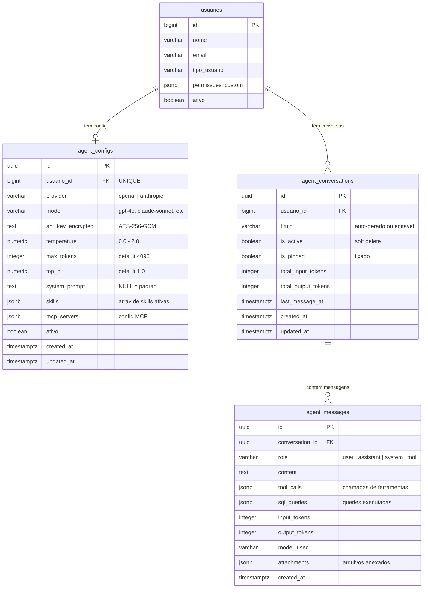

# Database Schema - Agente Megui

## Visao geral

O sistema do Agente Megui utiliza 3 tabelas no Supabase PostgreSQL, todas protegidas com Row Level Security (RLS) para garantir isolamento de dados por usuario.

Migration: `database/migrations/026_agent_megui_system.sql`

## Diagrama ER



## Tabelas

### 1. `agent_configs` - Configuracao do agente por usuario

Armazena as preferencias de cada usuario para o agente (modelo, API key, parametros, prompt). Cada usuario tem no maximo 1 registro (UNIQUE em `usuario_id`).

| Coluna | Tipo | Default | Nullable | Descricao |
|--------|------|---------|----------|-----------|
| `id` | UUID | `uuid_generate_v4()` | NOT NULL | Chave primaria |
| `usuario_id` | BIGINT | - | NOT NULL | FK para `usuarios(id)`, UNIQUE |
| `provider` | VARCHAR(50) | `'openai'` | NOT NULL | Provedor LLM: `'openai'` ou `'anthropic'` |
| `model` | VARCHAR(100) | `'gpt-4o'` | NOT NULL | Identificador do modelo |
| `api_key_encrypted` | TEXT | NULL | YES | API key encriptada com AES-256-GCM |
| `temperature` | NUMERIC(3,2) | `0.30` | YES | Temperatura do modelo (0.0 a 2.0) |
| `max_tokens` | INTEGER | `4096` | YES | Maximo de tokens na resposta |
| `top_p` | NUMERIC(3,2) | `1.00` | YES | Nucleus sampling |
| `system_prompt` | TEXT | NULL | YES | Prompt customizado (NULL = usar padrao) |
| `skills` | JSONB | `'["sql_query","schema_explorer","data_analysis"]'` | YES | Skills habilitadas |
| `mcp_servers` | JSONB | `'[]'` | YES | Configuracao de servidores MCP |
| `ativo` | BOOLEAN | `true` | NOT NULL | Status ativo |
| `created_at` | TIMESTAMPTZ | `CURRENT_TIMESTAMP` | YES | Data de criacao |
| `updated_at` | TIMESTAMPTZ | `CURRENT_TIMESTAMP` | YES | Ultima atualizacao (trigger) |

**Constraints:**
- PK: `id`
- UNIQUE: `usuario_id`
- FK: `usuario_id` REFERENCES `usuarios(id)` ON DELETE CASCADE

**Indices:**
- `idx_agent_configs_usuario` ON `(usuario_id)`

### 2. `agent_conversations` - Conversas (threads/abas)

Cada registro representa uma conversa/aba do usuario. Conversas podem ser fixadas e possuem contagem acumulada de tokens.

| Coluna | Tipo | Default | Nullable | Descricao |
|--------|------|---------|----------|-----------|
| `id` | UUID | `uuid_generate_v4()` | NOT NULL | Chave primaria |
| `usuario_id` | BIGINT | - | NOT NULL | FK para `usuarios(id)` |
| `titulo` | VARCHAR(255) | `'Nova conversa'` | NOT NULL | Titulo (auto-gerado ou editavel) |
| `is_active` | BOOLEAN | `true` | NOT NULL | Soft delete (false = deletado) |
| `is_pinned` | BOOLEAN | `false` | NOT NULL | Conversa fixada no topo |
| `total_input_tokens` | INTEGER | `0` | YES | Total acumulado de tokens de entrada |
| `total_output_tokens` | INTEGER | `0` | YES | Total acumulado de tokens de saida |
| `last_message_at` | TIMESTAMPTZ | `CURRENT_TIMESTAMP` | YES | Timestamp da ultima mensagem |
| `created_at` | TIMESTAMPTZ | `CURRENT_TIMESTAMP` | YES | Data de criacao |
| `updated_at` | TIMESTAMPTZ | `CURRENT_TIMESTAMP` | YES | Ultima atualizacao (trigger) |

**Constraints:**
- PK: `id`
- FK: `usuario_id` REFERENCES `usuarios(id)` ON DELETE CASCADE

**Indices:**
- `idx_agent_conversations_usuario` ON `(usuario_id)`
- `idx_agent_conversations_last_msg` ON `(last_message_at DESC)`

### 3. `agent_messages` - Mensagens das conversas

Cada mensagem dentro de uma conversa. Armazena conteudo, chamadas de ferramentas, queries SQL executadas e contagem de tokens.

| Coluna | Tipo | Default | Nullable | Descricao |
|--------|------|---------|----------|-----------|
| `id` | UUID | `uuid_generate_v4()` | NOT NULL | Chave primaria |
| `conversation_id` | UUID | - | NOT NULL | FK para `agent_conversations(id)` |
| `role` | VARCHAR(20) | - | NOT NULL | Papel: `'user'`, `'assistant'`, `'system'`, `'tool'` |
| `content` | TEXT | - | NOT NULL | Conteudo da mensagem |
| `tool_calls` | JSONB | NULL | YES | Chamadas de ferramentas do agent |
| `sql_queries` | JSONB | NULL | YES | Queries SQL executadas |
| `input_tokens` | INTEGER | `0` | YES | Tokens de entrada desta mensagem |
| `output_tokens` | INTEGER | `0` | YES | Tokens de saida desta mensagem |
| `model_used` | VARCHAR(100) | NULL | YES | Modelo que gerou a resposta |
| `attachments` | JSONB | NULL | YES | Arquivos anexados pelo usuario |
| `created_at` | TIMESTAMPTZ | `CURRENT_TIMESTAMP` | YES | Data de criacao |

**Constraints:**
- PK: `id`
- FK: `conversation_id` REFERENCES `agent_conversations(id)` ON DELETE CASCADE
- CHECK: `role IN ('user', 'assistant', 'system', 'tool')`

**Indices:**
- `idx_agent_messages_conversation` ON `(conversation_id)`
- `idx_agent_messages_created` ON `(created_at ASC)`

## Estrutura JSONB

### `tool_calls` (agent_messages)
```json
[
  {
    "tool_name": "query_sql_db",
    "args": {
      "input": "SELECT v.numero_venda, v.valor_final FROM vendas v ORDER BY v.valor_final DESC LIMIT 1"
    },
    "result": "[{\"numero_venda\": \"V-0847\", \"valor_final\": 5430.00}]"
  }
]
```

### `sql_queries` (agent_messages)
```json
[
  {
    "sql": "SELECT v.numero_venda, v.valor_final, cf.nome as cliente FROM vendas v LEFT JOIN clientes_fornecedores cf ON cf.id = v.cliente_id WHERE v.data_venda >= '2026-02-01' ORDER BY v.valor_final DESC LIMIT 1",
    "explanation": "Buscar a venda com maior valor do mes atual",
    "rows_returned": 1,
    "execution_time_ms": 42
  }
]
```

### `skills` (agent_configs)
```json
["sql_query", "schema_explorer", "data_analysis"]
```

### `mcp_servers` (agent_configs)
```json
[
  {
    "name": "Servidor Local",
    "url": "http://localhost:3001/mcp",
    "enabled": true,
    "description": "MCP server para ferramentas extras"
  }
]
```

### `attachments` (agent_messages)
```json
[
  {
    "name": "relatorio.csv",
    "type": "text/csv",
    "size": 15420
  }
]
```

## Row Level Security (RLS)

Todas as 3 tabelas tem RLS habilitado. As policies garantem que cada usuario so pode ver/modificar seus proprios dados.

### Padrao de policy
```sql
-- Verifica se o usuario autenticado e dono do registro
usuario_id IN (
    SELECT id FROM usuarios
    WHERE supabase_user_id = auth.uid()
)
```

### Policies por tabela

| Tabela | SELECT | INSERT | UPDATE | DELETE |
|--------|--------|--------|--------|--------|
| `agent_configs` | Proprio | Proprio | Proprio | - |
| `agent_conversations` | Proprio | Proprio | Proprio | Proprio |
| `agent_messages` | Via conversa propria | Via conversa propria | - | - |

Para `agent_messages`, a policy verifica que o `conversation_id` pertence a uma conversa do usuario autenticado:
```sql
conversation_id IN (
    SELECT ac.id FROM agent_conversations ac
    JOIN usuarios u ON u.id = ac.usuario_id
    WHERE u.supabase_user_id = auth.uid()
)
```

## Funcao read-only para queries SQL

```sql
CREATE OR REPLACE FUNCTION execute_readonly_query(query_text TEXT)
RETURNS JSONB
LANGUAGE plpgsql
SECURITY DEFINER
SET statement_timeout = '10s'
SET work_mem = '16MB'
```

Camada de seguranca adicional que:
- Bloqueia keywords: INSERT, UPDATE, DELETE, DROP, CREATE, ALTER, TRUNCATE, GRANT, REVOKE, COPY
- Exige que a query comece com SELECT ou WITH
- Timeout de 10 segundos
- Limite de 500 linhas no resultado
- Retorna resultado como JSONB

## Triggers

- `trigger_agent_configs_updated_at`: Atualiza `updated_at` automaticamente em UPDATE
- `trigger_agent_conversations_updated_at`: Atualiza `updated_at` automaticamente em UPDATE

## Referencia

- Migration base: `database/migrations/004_feedback_system.sql` (padrao de RLS usado no projeto)
- Tabela usuarios: `database/migrations/supabase_schema.sql`
