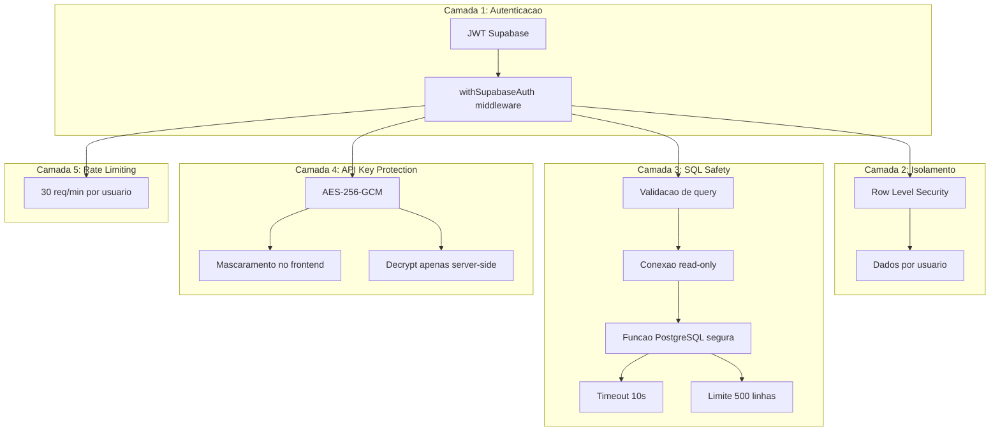

# Modelo de Seguranca - Agente Megui

## Visao geral

O Agente Megui lida com dados sensiveis do negocio (vendas, clientes, financeiro) e API keys de provedores LLM. A seguranca e implementada em multiplas camadas para garantir que:

1. Nenhuma operacao destrutiva seja executada no banco
2. API keys nunca sejam expostas ao frontend
3. Cada usuario so acesse seus proprios dados
4. O sistema seja resistente a abuso

## Camadas de seguranca



---

## Camada 1: Autenticacao

### JWT Verification

Todas as rotas da API do agente (`/api/agente/*`) usam o middleware `withSupabaseAuth` existente no projeto (de `lib/supabase-middleware.ts`).

**Fluxo:**
1. Request chega com JWT do Supabase nos cookies
2. `verifySupabaseUser()` valida o token via `supabase.auth.getUser()`
3. Busca perfil do usuario na tabela `usuarios`
4. Injeta `req.user` e `req.supabaseClient` no request
5. Se JWT invalido ou expirado → 401 Unauthorized

**Referencia:** `lib/supabase-middleware.ts`, `lib/supabase-auth.ts`

---

## Camada 2: Isolamento de dados (RLS)

### Row Level Security

As 3 tabelas do agente (`agent_configs`, `agent_conversations`, `agent_messages`) tem RLS habilitado com policies que verificam `auth.uid()`.

**Garantia:** Um usuario NUNCA consegue:
- Ver conversas de outro usuario
- Ler mensagens de conversas que nao sao suas
- Acessar ou modificar configuracoes de outro usuario

### Padrao de policy

```sql
-- Usuarios so veem seus proprios registros
CREATE POLICY agent_configs_select ON agent_configs
    FOR SELECT USING (
        usuario_id IN (
            SELECT id FROM usuarios
            WHERE supabase_user_id = auth.uid()
        )
    );
```

Para `agent_messages`, a policy e via `agent_conversations`:
```sql
CREATE POLICY agent_messages_select ON agent_messages
    FOR SELECT USING (
        conversation_id IN (
            SELECT ac.id FROM agent_conversations ac
            JOIN usuarios u ON u.id = ac.usuario_id
            WHERE u.supabase_user_id = auth.uid()
        )
    );
```

---

## Camada 3: SQL Safety (Read-Only)

### 3.1 Validacao no servidor (API Route)

Antes de enviar a query ao banco, a API route valida:

```typescript
function validateSqlQuery(sql: string): { valid: boolean; error?: string } {
  const normalized = sql.trim().toUpperCase()

  // Deve comecar com SELECT ou WITH (CTEs)
  if (!normalized.match(/^\s*(SELECT|WITH)\b/)) {
    return { valid: false, error: 'Query deve comecar com SELECT ou WITH' }
  }

  // Bloquear keywords perigosas
  const forbidden = [
    'INSERT', 'UPDATE', 'DELETE', 'DROP', 'CREATE', 'ALTER',
    'TRUNCATE', 'GRANT', 'REVOKE', 'COPY', 'EXECUTE',
    'SET ROLE', 'SET SESSION'
  ]

  for (const keyword of forbidden) {
    if (normalized.includes(keyword)) {
      return { valid: false, error: `Keyword proibida: ${keyword}` }
    }
  }

  return { valid: true }
}
```

### 3.2 LangChain SqlToolkit

O SqlToolkit do LangChain ja possui validacao interna que bloqueia operacoes DML/DDL. Essa e uma segunda camada de protecao.

### 3.3 Funcao PostgreSQL (execute_readonly_query)

Terceira camada de protecao no nivel do banco de dados:

```sql
CREATE OR REPLACE FUNCTION execute_readonly_query(query_text TEXT)
RETURNS JSONB
LANGUAGE plpgsql
SECURITY DEFINER
SET statement_timeout = '10s'    -- Timeout de 10 segundos
SET work_mem = '16MB'            -- Limite de memoria
AS $$
DECLARE
  result JSONB;
  normalized TEXT;
BEGIN
  normalized := UPPER(TRIM(query_text));

  -- Bloquear operacoes perigosas
  IF normalized ~ '\b(INSERT|UPDATE|DELETE|DROP|CREATE|ALTER|TRUNCATE|GRANT|REVOKE|COPY)\b' THEN
    RAISE EXCEPTION 'Only SELECT queries are allowed. Detected forbidden keyword.';
  END IF;

  -- Deve comecar com SELECT ou WITH
  IF NOT (normalized ~ '^\s*(SELECT|WITH)\b') THEN
    RAISE EXCEPTION 'Query must start with SELECT or WITH';
  END IF;

  -- Executar com limite de 500 linhas
  EXECUTE format(
    'SELECT jsonb_agg(row_to_json(t)) FROM (SELECT * FROM (%s) sub LIMIT 500) t',
    query_text
  ) INTO result;

  RETURN COALESCE(result, '[]'::jsonb);
END;
$$;
```

### 3.4 Conexao read-only

A conexao TypeORM ao banco usa uma connection string dedicada com usuario que tem apenas permissao SELECT:

```typescript
const datasource = new DataSource({
  type: 'postgres',
  url: process.env.SUPABASE_DB_URL,
  // Apenas tabelas selecionadas sao acessiveis
})

const db = await SqlDatabase.fromDataSourceParams({
  appDataSource: datasource,
  includesTables: [
    'vendas', 'vendas_itens', 'clientes_fornecedores',
    'produtos', 'estoques', 'produtos_estoques',
    'vendedores', 'transacoes', 'categorias_financeiras',
    'formas_pagamento', 'venda_parcelas',
    'movimentacoes_estoque', 'bling_vendas', 'bling_nfe'
  ],
  // Tabelas sensíveis EXCLUIDAS:
  // usuarios, role_permissions_config, agent_configs
})
```

**Tabelas NUNCA acessiveis pelo SQL Agent:**
- `usuarios` - Dados sensiveis (emails, senhas hash, permissoes)
- `role_permissions_config` - Configuracao de permissoes
- `agent_configs` - API keys encriptadas
- `agent_conversations` / `agent_messages` - Historico privado

### 3.5 Limites de protecao

| Protecao | Valor | Descricao |
|----------|-------|-----------|
| Timeout | 10s | Query e cancelada apos 10 segundos |
| Max linhas | 500 | Resultado limitado a 500 linhas |
| Max steps | 5 | Agent faz no maximo 5 chamadas de tool por pergunta |
| Work mem | 16MB | Limite de memoria por query |

---

## Camada 4: Protecao de API Keys

### Encriptacao

API keys dos usuarios sao encriptadas com **AES-256-GCM** antes de serem salvas no banco.

**Implementacao:**
```typescript
// lib/agent-crypto.ts
import crypto from 'crypto'

const ALGORITHM = 'aes-256-gcm'
const KEY = Buffer.from(process.env.AGENT_ENCRYPTION_KEY!, 'hex') // 32 bytes

export function encryptApiKey(plaintext: string): string {
  const iv = crypto.randomBytes(16)
  const cipher = crypto.createCipheriv(ALGORITHM, KEY, iv)

  let encrypted = cipher.update(plaintext, 'utf8', 'hex')
  encrypted += cipher.final('hex')

  const authTag = cipher.getAuthTag()

  // Formato: iv:authTag:encrypted
  return `${iv.toString('hex')}:${authTag.toString('hex')}:${encrypted}`
}

export function decryptApiKey(ciphertext: string): string {
  const [ivHex, authTagHex, encrypted] = ciphertext.split(':')

  const iv = Buffer.from(ivHex, 'hex')
  const authTag = Buffer.from(authTagHex, 'hex')
  const decipher = crypto.createDecipheriv(ALGORITHM, KEY, iv)
  decipher.setAuthTag(authTag)

  let decrypted = decipher.update(encrypted, 'hex', 'utf8')
  decrypted += decipher.final('utf8')

  return decrypted
}
```

### Chave de encriptacao

- Armazenada em **Doppler** como `AGENT_ENCRYPTION_KEY`
- Formato: 64 caracteres hexadecimais (32 bytes)
- Gerar com: `openssl rand -hex 32`
- NUNCA commitada no codigo ou armazenada no banco

### Mascaramento no frontend

A API nunca retorna a API key completa. Em vez disso:

```typescript
// GET /api/agente/config retorna:
{
  "has_api_key": true,
  "api_key_preview": "sk-...abc"  // Primeiros 3 + ... + ultimos 3 caracteres
}
```

### Fluxo de uso da API key

```
1. Usuario digita API key no frontend
2. Frontend envia via PUT /api/agente/config
3. API route encripta com AES-256-GCM
4. Salva texto encriptado em agent_configs.api_key_encrypted
5. Quando chat e usado, API route decripta a key
6. Key decriptada usada apenas em memoria para criar o LLM client
7. Key nunca logada ou retornada ao frontend
```

---

## Camada 5: Rate Limiting

### Implementacao

Rate limiter simples baseado em memoria (Map) na API route de chat:

```typescript
const rateLimiter = new Map<number, { count: number; resetAt: number }>()

function checkRateLimit(userId: number): boolean {
  const now = Date.now()
  const userLimit = rateLimiter.get(userId)

  if (!userLimit || now > userLimit.resetAt) {
    rateLimiter.set(userId, { count: 1, resetAt: now + 60000 })
    return true
  }

  if (userLimit.count >= 30) {
    return false // 429 Too Many Requests
  }

  userLimit.count++
  return true
}
```

### Limites

| Recurso | Limite | Janela |
|---------|--------|--------|
| Chat requests | 30 | 1 minuto |
| Config updates | 10 | 1 minuto |
| Conversation creates | 20 | 1 minuto |

---

## Resumo de ameacas e mitigacoes

| Ameaca | Mitigacao |
|--------|----------|
| SQL Injection | 3 camadas: validacao no servidor, SqlToolkit, funcao PG |
| Queries destrutivas (DELETE, DROP) | Bloqueio de keywords + conexao read-only |
| Queries lentas (DoS) | Timeout 10s + work_mem limit |
| Exfiltracao de dados (tabelas sensiveis) | `includesTables` whitelist exclui tabelas sensiveis |
| Roubo de API key | AES-256-GCM + nunca retornada ao frontend |
| Acesso a dados de outro usuario | RLS policies + verificacao por `auth.uid()` |
| Abuso do servico | Rate limiting 30 req/min |
| JWT expirado/invalido | `withSupabaseAuth` middleware rejeita com 401 |
| Prompt injection (LLM) | System prompt com regras claras + SQL validation |

## Logs e auditoria

- Todas as queries SQL executadas sao salvas em `agent_messages.sql_queries`
- Erros de validacao SQL sao logados no servidor
- Uso de service role key e logado (padrao existente do projeto)
- Contagem de tokens por conversa permite monitorar uso

## Checklist de seguranca antes do deploy

- [ ] `AGENT_ENCRYPTION_KEY` configurada no Doppler (dev e prod)
- [ ] `SUPABASE_DB_URL` configurada no Doppler (dev e prod)
- [ ] Migration 026 executada com RLS policies
- [ ] Funcao `execute_readonly_query` criada no Supabase
- [ ] Verificar que tabelas sensíveis NAO estao na whitelist do SqlDatabase
- [ ] Testar que INSERT/UPDATE/DELETE sao bloqueados
- [ ] Testar isolamento entre usuarios (RLS)
- [ ] Verificar que API key nao aparece em logs do servidor
- [ ] Rate limiting testado
