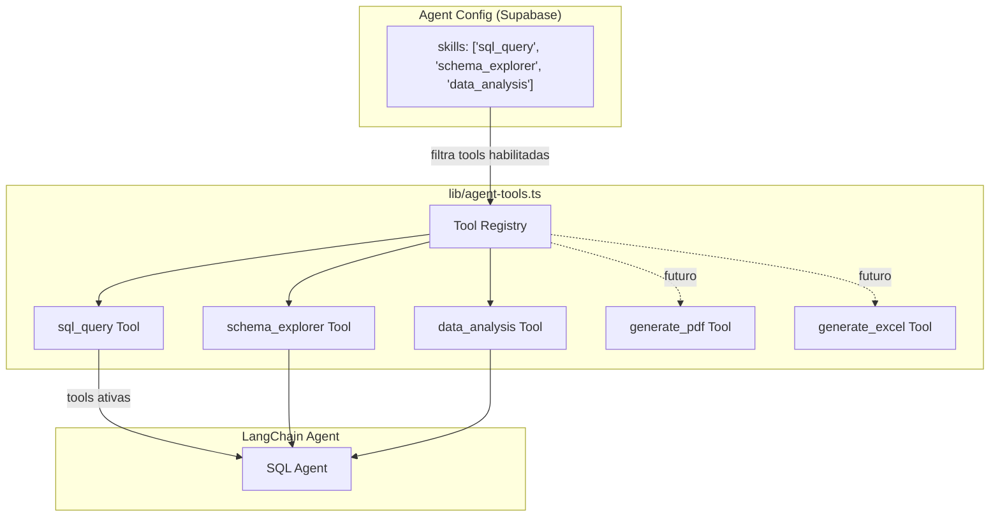

# Sistema de Skills - Agente Megui

## O que sao Skills

Skills sao capacidades que o Agente Megui pode executar. Cada skill e implementada como um **LangChain Tool** que o agente pode chamar durante o processamento de uma pergunta. O usuario pode habilitar/desabilitar skills individualmente na aba de Configuracao.

## Arquitetura



### Como funciona

1. Quando o usuario envia uma mensagem, a API route busca o `agent_configs` do usuario
2. O campo `skills` (JSONB array) lista quais skills estao habilitadas
3. O `lib/agent-tools.ts` tem um registro de todas as tools disponiveis
4. Apenas as tools habilitadas sao passadas ao LangChain Agent
5. O agent decide autonomamente quais tools usar para responder a pergunta

### Implementacao

```typescript
// lib/agent-tools.ts
import { DynamicStructuredTool } from '@langchain/core/tools'
import { z } from 'zod'

// Registro de todas as tools disponiveis
export const toolRegistry: Record<string, () => DynamicStructuredTool> = {

  sql_query: () => new DynamicStructuredTool({
    name: 'query_sql_db',
    description: 'Executa uma query SQL SELECT read-only no banco de dados',
    schema: z.object({
      input: z.string().describe('A query SQL SELECT para executar'),
    }),
    func: async ({ input }) => {
      // Validacao + execucao via TypeORM
    },
  }),

  schema_explorer: () => new DynamicStructuredTool({
    name: 'info_sql_db',
    description: 'Retorna informacoes sobre o schema de uma ou mais tabelas',
    schema: z.object({
      tables: z.string().describe('Nomes das tabelas separados por virgula'),
    }),
    func: async ({ tables }) => {
      // Retorna CREATE TABLE statement
    },
  }),

  // ... mais tools
}

// Funcao para montar as tools habilitadas
export function getEnabledTools(skills: string[]): DynamicStructuredTool[] {
  return skills
    .filter(skill => toolRegistry[skill])
    .map(skill => toolRegistry[skill]())
}
```

---

## Skills da Fase 1 (MVP)

### 1. `sql_query` - Consulta SQL

**Descricao:** Executa queries SQL SELECT read-only no banco de dados PostgreSQL do MeguisPet.

**Tool name:** `query_sql_db`

**Input:**
```json
{
  "input": "SELECT v.numero_venda, v.valor_final FROM vendas v ORDER BY v.valor_final DESC LIMIT 5"
}
```

**Output:** String JSON com os resultados da query.

**Seguranca:**
- Apenas SELECT/WITH sao permitidos
- Keywords DDL/DML bloqueadas (INSERT, UPDATE, DELETE, DROP, etc)
- Timeout de 10 segundos
- Limite de 500 linhas
- Conexao read-only ao banco

**Quando o agent usa:** Sempre que precisa buscar dados reais do banco para responder uma pergunta.

---

### 2. `schema_explorer` - Explorador de Schema

**Descricao:** Retorna informacoes sobre a estrutura (schema) das tabelas do banco de dados.

**Tool name:** `info_sql_db`

**Input:**
```json
{
  "tables": "vendas, vendas_itens"
}
```

**Output:** DDL (CREATE TABLE statements) das tabelas solicitadas, incluindo colunas, tipos e constraints.

**Quando o agent usa:** Antes de gerar uma query SQL, para entender a estrutura das tabelas e saber quais colunas usar.

---

### 3. `data_analysis` - Analise de Dados

**Descricao:** Formata e analisa dados retornados de queries SQL, gerando insights e resumos.

**Tool name:** `analyze_data`

**Input:**
```json
{
  "data": [{"nome": "Produto A", "total": 150}, {"nome": "Produto B", "total": 120}],
  "analysis_type": "ranking",
  "context": "Top produtos vendidos no mes"
}
```

**Output:** Texto formatado com analise e insights.

**Quando o agent usa:** Para gerar resumos, comparacoes e insights a partir de dados brutos.

---

## Skills Futuras (Fase 7+)

### 4. `generate_pdf` - Gerar Relatorio PDF

**Status:** Planejado

**Descricao:** Gera um relatorio em PDF com tabelas e dados formatados.

**Dependencias existentes no projeto:** `jspdf` (3.0.2), `jspdf-autotable` (5.0.2) - ja instalados.

**Tool name:** `generate_pdf`

**Input:**
```json
{
  "titulo": "Relatorio de Vendas - Fevereiro 2026",
  "dados": [
    {"venda": "V-0847", "cliente": "Pet Shop Amigos", "valor": 5430.00},
    {"venda": "V-0842", "cliente": "Vet Care", "valor": 3200.00}
  ],
  "tipo": "tabela"
}
```

**Output:** URL temporaria para download do PDF gerado.

**Implementacao planejada:**
```typescript
generate_pdf: () => new DynamicStructuredTool({
  name: 'generate_pdf',
  description: 'Gera um relatorio em PDF com os dados fornecidos',
  schema: z.object({
    titulo: z.string().describe('Titulo do relatorio'),
    dados: z.array(z.record(z.unknown())).describe('Dados para a tabela'),
    tipo: z.enum(['tabela', 'resumo']).describe('Formato do relatorio'),
  }),
  func: async ({ titulo, dados, tipo }) => {
    // Usa jspdf + jspdf-autotable
    const doc = new jsPDF()
    doc.text(titulo, 14, 20)
    autoTable(doc, {
      head: [Object.keys(dados[0])],
      body: dados.map(row => Object.values(row)),
      startY: 30,
    })
    // Salva em storage temporario e retorna URL
    const pdfBuffer = doc.output('arraybuffer')
    // Upload para Supabase Storage ou gerar base64
    return `PDF gerado: ${titulo} (${dados.length} linhas)`
  },
}),
```

---

### 5. `generate_excel` - Exportar Excel

**Status:** Planejado

**Descricao:** Exporta dados em formato XLSX (Excel).

**Dependencias existentes no projeto:** `xlsx` (0.18.5) - ja instalado.

**Tool name:** `generate_excel`

**Input:**
```json
{
  "titulo": "Vendas Fevereiro",
  "sheets": [
    {
      "name": "Vendas",
      "data": [{"venda": "V-0847", "valor": 5430.00}]
    }
  ]
}
```

**Output:** URL temporaria para download do XLSX.

---

### 6. `create_sale` - Criar Rascunho de Venda

**Status:** Planejado

**Descricao:** Cria um rascunho de venda no sistema MeguisPet. Requer confirmacao do usuario antes de salvar.

**Tool name:** `create_sale`

**Seguranca adicional:**
- Cria apenas como RASCUNHO (nao finaliza a venda)
- Exige confirmacao via human-in-the-loop
- Disponivel apenas para usuarios com permissao `criar_vendas`
- Log de auditoria completo

---

### 7. `send_email` - Enviar Email

**Status:** Planejado

**Descricao:** Envia um email com relatorio ou dados para um destinatario.

**Tool name:** `send_email`

**Seguranca adicional:**
- Rate limit de 5 emails/hora por usuario
- Apenas para emails cadastrados no sistema
- Log de todos os envios

---

### 8. `generate_chart` - Gerar Grafico

**Status:** Planejado

**Descricao:** Renderiza um grafico visual com dados.

**Dependencias existentes no projeto:** `recharts` (3.3.0) - ja instalado.

**Tool name:** `generate_chart`

**Tipos de grafico:** barra, linha, pizza, area

---

### 9. `query_bling` - Consultar Bling ERP

**Status:** Planejado

**Descricao:** Busca dados da integracao com o Bling ERP (vendas, NFe).

**Tabelas acessiveis:** `bling_vendas`, `bling_nfe`

---

## Como adicionar uma nova skill

1. **Definir o tool** em `lib/agent-tools.ts`:
```typescript
toolRegistry['nova_skill'] = () => new DynamicStructuredTool({
  name: 'nome_da_tool',
  description: 'Descricao clara do que a tool faz',
  schema: z.object({
    // Parametros de entrada com Zod
  }),
  func: async (params) => {
    // Logica de execucao
    // Retorna string com resultado
  },
})
```

2. **Adicionar na UI** em `components/agente/SkillsConfig.tsx`:
```typescript
const availableSkills = [
  // ... skills existentes
  {
    id: 'nova_skill',
    name: 'Nome da Skill',
    description: 'O que essa skill faz',
    icon: IconeDoLucide,
    available: true,  // false = "em breve"
  },
]
```

3. **Habilitar no config padrao** (opcional) em `lib/agent-default-prompt.ts` ou na migration default:
```sql
UPDATE agent_configs SET skills = skills || '"nova_skill"'::jsonb;
```

## Controle de acesso por skill

Embora o Agente Megui nao tenha permissao especifica (todos podem acessar), skills individuais podem ser restritas:

| Skill | Quem pode habilitar |
|-------|---------------------|
| sql_query | Todos |
| schema_explorer | Todos |
| data_analysis | Todos |
| generate_pdf | Todos |
| generate_excel | Todos |
| create_sale | Apenas usuarios com `criar_vendas` |
| send_email | Apenas admin/gerente |
| query_bling | Apenas usuarios com `configuracoes` |

O controle e feito no `lib/agent-tools.ts` verificando `req.user.permissoes` antes de habilitar a tool.
